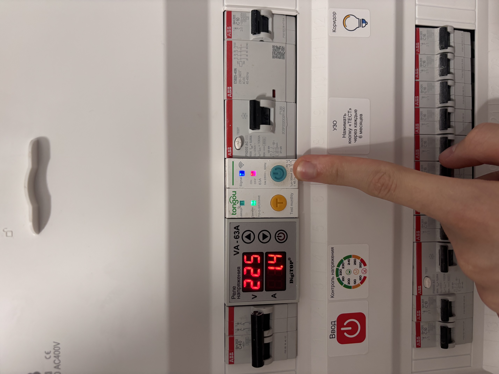
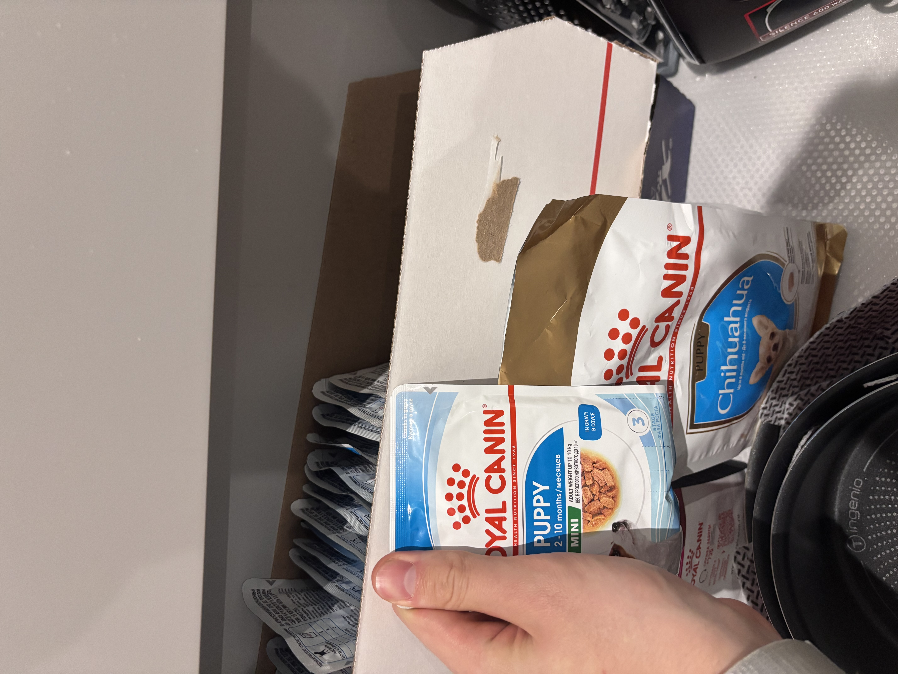
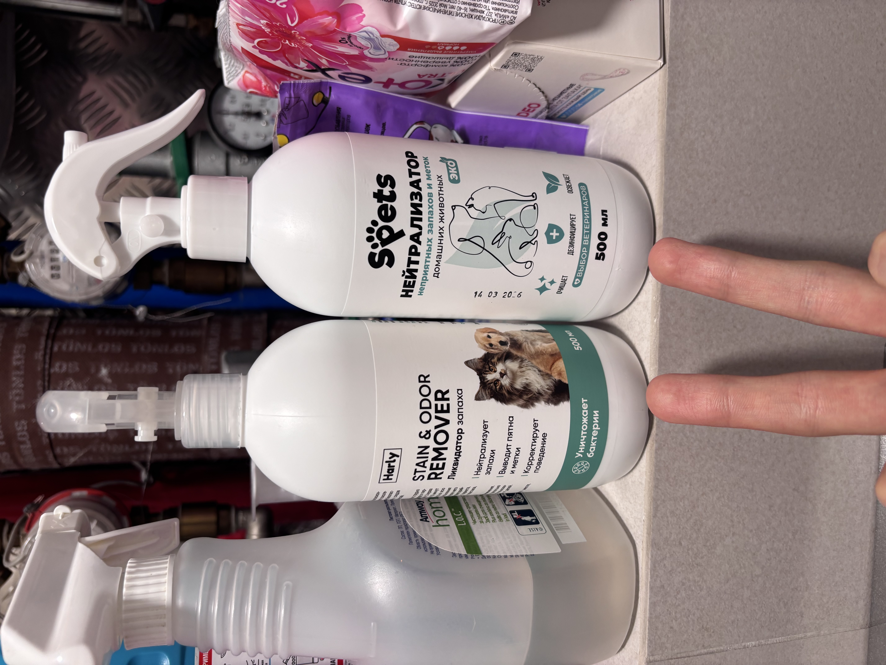
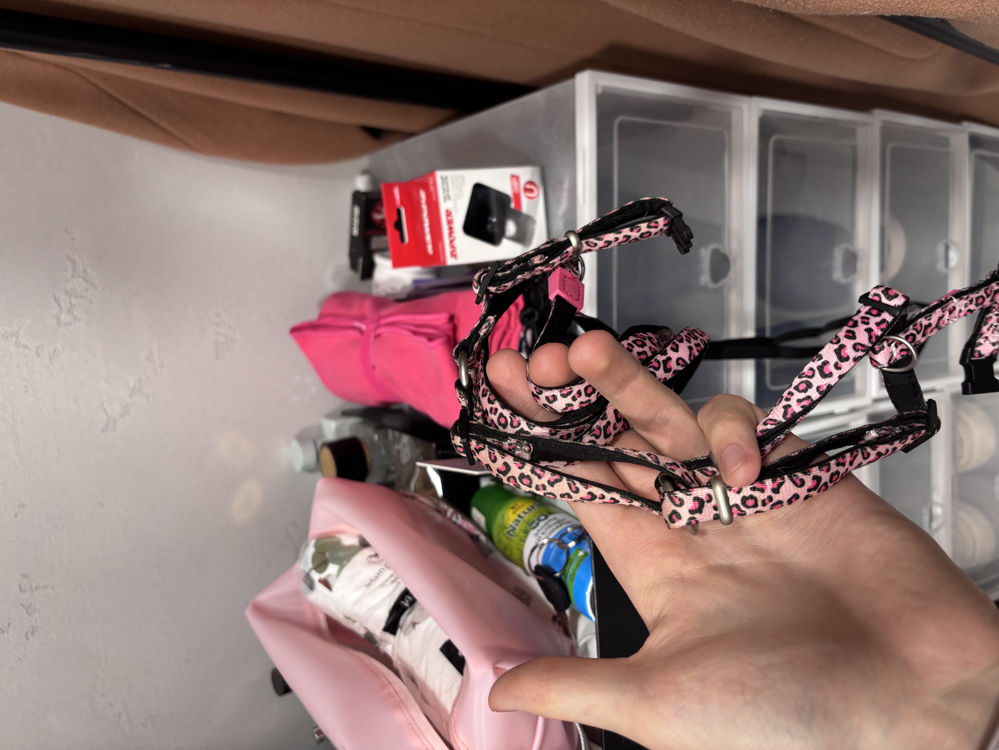
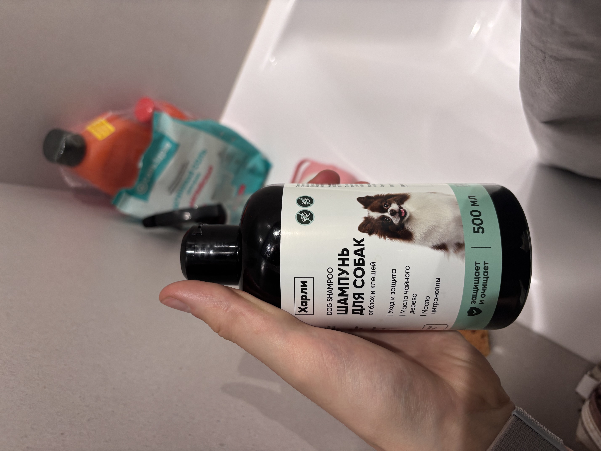
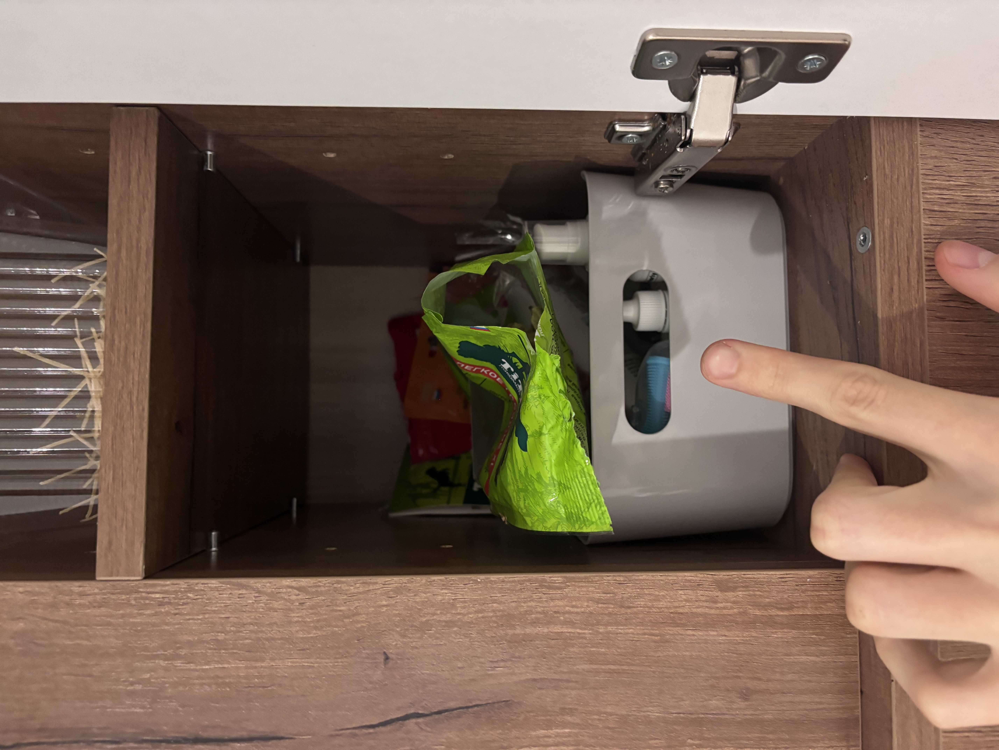
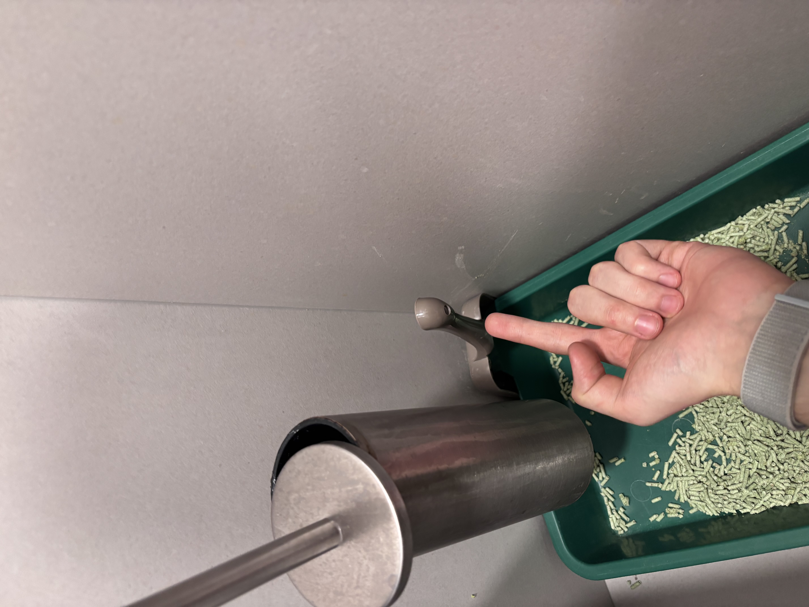
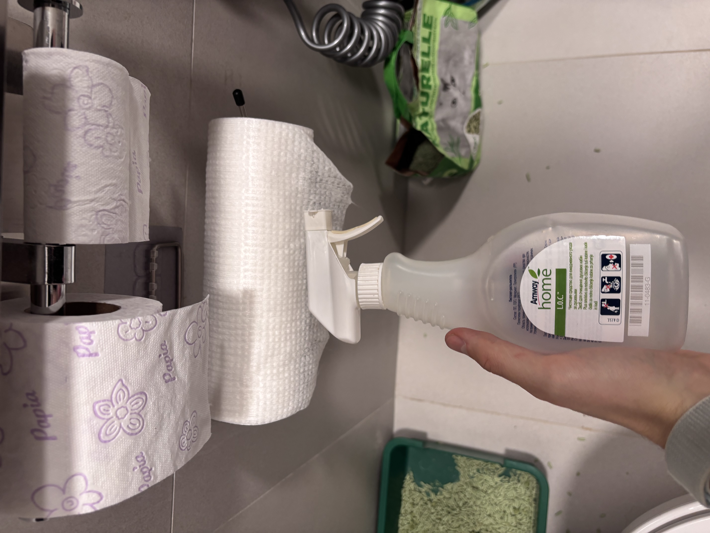
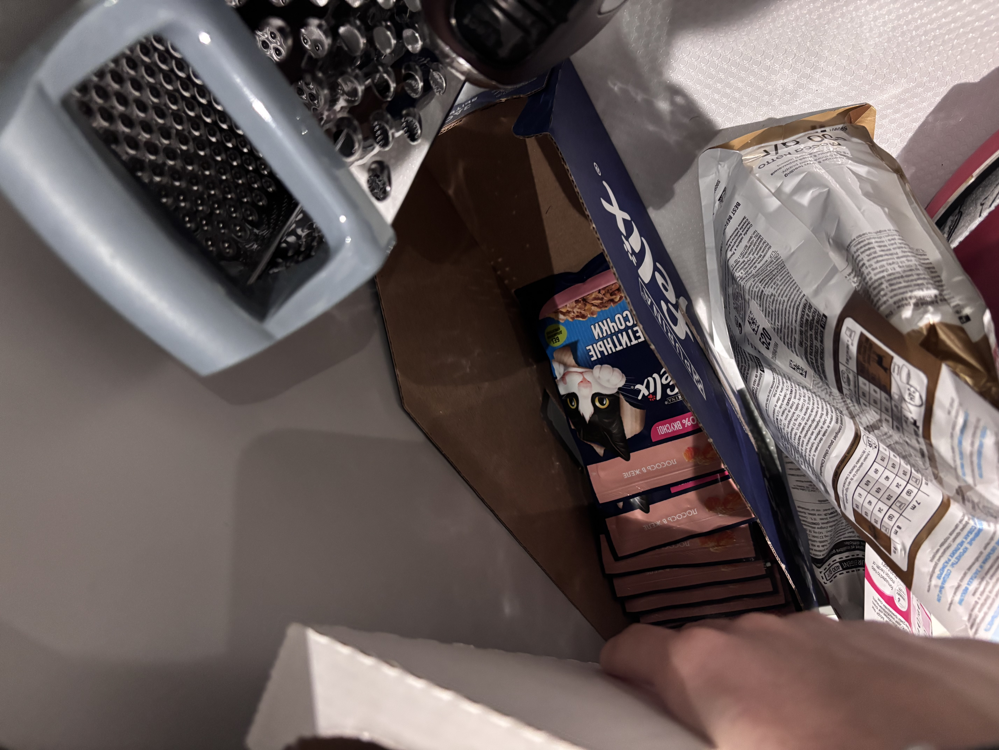

# 🏠 Инструкция к выживанию

> Главное правило: не повышать голос на животных и сильно не ругать. У них и так может быть стресс — Лея от этого может перестать есть и начать блевать.
> Без необходимиости не выходить на улицу. 

---

## 🧺 Дом

Всё, что не прибито гвоздями — можно пользоваться.

- [ ] Не мыть кастрюли в посудомойке и не использовать с ними металлические лопатки/ложки
- [ ] Если выключится свет — сделать комбинацию кнопок в щитке *(см. ФОТО)*
- [ ] Стирка: капсулы, отбеливатель, кислородный отбеливатель, пятновыводитель, кондиционер — на машинке либо слева от неё
- [ ] Посудомойка: капсулы и ополаскиватель — на подоконнике
- [ ] Моющие средства (например, средство от жира) — слева от машинки, самая нижняя полка
- [ ] Плита: из-за особенностей силового шнура нельзя включать параллельно больше 2 конфорок (выбьет свет)
- [ ] Поливать цветы раз в 5–7 дней! Лейка — на подоконнике в спальне, вода — питьевая

---

## 🐕 Лея

- [ ] Ест утром и вечером — по половине пачки влажного корма (итого 1 пачка в день). Пачки — в нижнем выдвижном шкафчике кухни *(ФОТО)*
- [ ] Проверять наличие сухого корма — автокормушка может лагать и не насыпать, при необходимости досыпать
- [ ] Проверять наличие воды в автопоилке, доливать по необходимости
- [ ] Может ходить на диван — на этот случай там водонепроницаемое покрывало. Подушки лучше держать в стоячем положении, во избежание казусов *(ФОТО)*
- [ ] Может ходить на кровать. Днём лучше закрывать дверь в спальню (не забыть Васю в закрытой комнате!). Ночью на кровать лучше не пускать, но если запрыгнула — не ругать (испугается и нассыт). Можно аккуратно спустить или оставить поспать вместе, но спустить при пробуждении
- [ ] Проверять пелёнки на чистоту и свободное место — если половина уже занята, постелить чистую. Пелёнки — на подоконнике
- [ ] Если промахнётся — убрать специальным средством, иначе останется запах *(ФОТО)*
- [ ] Для прогулки нужны шлейка и поводок *(ФОТО)*. После прогулки обязательно мыть лапы (при сильном загрязнении — мыть полностью). Уши и голову не мочить. Шампунь — специальный, от клещей *(ФОТО)*
- [ ] Любит играть, знает команды: *зайка, лежать, ползи, сидеть, дай лапу, нельзя.* За выполнение — поощрять вкусняшкой *(ФОТО)*
- [ ] За хорошие поступки (например, сходила в лоток) — можно дать 1–2 больших вкусняшки *(ФОТО)*
- [ ] Не давать еду со стола — желудок очень чувствительный, всё выйдет обратно (в том или ином виде)

---

## 🐈 Вася

- [ ] С ним проще. Ходит в лоток — наполнитель убирать в унитаз с помощью лопатки *(ФОТО)*. Наполнитель растворяется в воде, переживать не стоит 
- [ ] Периодически промахивается «по большому» — убрать бумажным полотенцем или как удобно. Следы на плитке убираются специальным средством *(ФОТО)*
- [ ] Кормить по половине пачки кошачьего корма 3 раза в день (расход — 1,5 пачки в день) *(ФОТО)*
- [ ] Можно подсыпать сухой корм, но он неплохо подъедает и собачий — если забылось или Лея успела съесть, не страшно. Главное — не ругать ни его, ни её